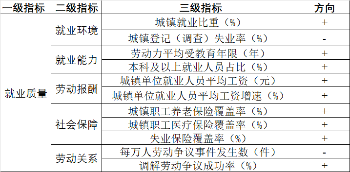

# 综合指数测算 {#sec-comp-index}

适用于数学建模、经济计量中测算，比如数字经济、就业质量、新质生产力等。

简单流程：

(1) 构建（三级）指标体系
(2) 搜集指标数据，预处理：正向化、归一化/标准化等
(3) 熵权法：计算三级指标权重
(4) 向上加权合成到二级指标值
(5) 熵权法：计算二级指标权重
(6) 向上加权合成到一级指标值

当然，也可以改进，比如赋权法用主客观组合赋权；融入评价算法：TOPSIS 等（**注意：不适合后续接回归分析！**）。

```{r message=FALSE}
library(tidyverse)
library(mathmodels)
library(readxl)
```

下面以测算 2020-2022 年 30 个省份的就业质量为例。

```{r}
#| echo: false
#| fig.cap: "就业质量评价指标体系（Sheet2）"
#| out.width: "70%"

```

```{r}
df = read_excel("data/employment-quality.xlsx", skip = 1)
glimpse(df)
```

## 熵权法赋权 + 综合得分

指标数据预处理：量纲一致，方向一致。

**熵权法**，是一种根据各项指标数据所提供的信息量大小（离散程度）来确定指标权重的客观赋权法。

注意，熵权法已内置归一化，要避免做两次归一化。

准备指标方向向量：`NA` 表示不做内置归一化，`"+"` 表示做内置正向归一化，`"-"` 表示做内置负向归一化。

### (1) 三级指标向上合成到二级指标  {.unnumbered}

- 读取指标体系数据，按二级指标切分，据此就能分别取出每组的三级指标数据和方向向量

```{r}
dat = read_excel("data/employment-quality.xlsx", sheet = 2) |> 
  fill(1:2) |> 
  mutate(二级指标 = as_factor(二级指标))  # 保证原顺序
splits = split(dat, dat$二级指标)
```


- `map` 循环迭代就能批量执行该层级上的所有熵权法，提取各三级指标的熵权权重

```{r}
rlt = map(splits, \(x) entropy_weight(df[x$三级指标], x$方向))
w_obj = map(rlt, "w") 
```

- 提取三级指标权重

```{r}
tibble(三级指标 = dat$三级指标, 熵权权重 = unlist(w_obj))
```


- 提取二级指标的综合得分，合并到数据框

```{r}
df1 = bind_cols(df[1:2], map_df(rlt, "s"))
```

#### (2) 二级指标向上合成到一级指标 {.unnumbered}

- 执行熵权法，提取各二级指标熵权权重

```{r}
rlt = entropy_weight(df1[3:7], rep("+",5))
rlt$w
```

- 提取一级指标综合得分

```{r}
df1 = df1 |> 
  mutate(就业质量 = rlt$s)
df1
```


其它支持的客观赋权法还有：`pca_weight()`（PCA 赋权）、`critic_weight()`（CRITIC 赋权）。

## 主客观组合赋权 + 综合得分

若想让一级指标得分更有实际意义，应该将主观权重纳入考量。

**层次分析法**，通过综合两两比较各指标相对重要程度来确定指标权重的主观赋权法。

#### (1) 三级指标向上合成到二级指标  {.unnumbered}

- 问 AI 得到的该层级上各判断矩阵，批量执行 AHP

```{r}
As = list(matrix(c(1, 1/3,
                   3,   1), nrow = 2, byrow = TRUE),
          matrix(c(1,   3,
                   1/3, 1), nrow = 2, byrow = TRUE),
          matrix(c(1,   3,
                   1/3, 1), nrow = 2, byrow = TRUE),
          matrix(c(1,   2,   3,
                   1/2, 1,   2,
                   1/3, 1/2, 1), nrow = 3, byrow = TRUE),
          matrix(c(1,   3,
                   1/3, 1), nrow = 2, byrow = TRUE))
rlt = map(As, AHP)
```

- 提取各一致性比率，要求一致性比率 $< 0.1$，否则需要调整判断矩阵

```{r}
map_dbl(rlt, "CR")
```

- 提取各三级指标的 AHP 权重

```{r}
w_subj = map(rlt, "w")
```

- 基于博弈论法批量组合各组主客观权重

```{r}
ws = map2(w_subj, w_obj, 
          \(x, y) combine_weights(x, y, type = "game"))
```

- 合并三级指标的三种权重结果

```{r}
bind_cols(dat[2:3], 熵权重 = unlist(w_obj), 
          AHP权重 = unlist(w_subj), 组合权重 = unlist(ws))
```

- 批量计算：每组三级指标向上合成到二级指标值，注意三级指标值需要先做归一化。

```{r}
df = df |> 
  mutate(across(c(3,5:11,13), mathmodels::rescale),
         across(c(4,12), \(x) mathmodels::rescale(x, "-")))
df1 = bind_cols(df[1:2],
  map2_df(splits, ws,
          \(x, y) 100 * linear_sum(df[x$三级指标], y)))
```


#### (2) 二级指标向上合成到一级指标  {.unnumbered}

- 计算各二级指标熵权权重

```{r}
w_obj = entropy_weight(df1[3:7], rep("+",5))$w
```

- 问 AI 得到该层级的判断矩阵，执行 AHP，提取一致性比率

```{r}
A = matrix(c(1, 1/2, 1/5, 1/4, 1/3,
             2,  1,  1/3, 1/2,  1,
             5,  3,   1,   3,   5,
             4,  2,  1/3,  1,   3,
             3,  1,  1/5, 1/3,  1), nrow = 5, byrow = TRUE)
rlt = AHP(A)
rlt$CR
```

- 提取 AHP 权重

```{r}
w_subj = rlt$w
```

- 基于博弈论法组合主客观权重

```{r}
w = combine_weights(w_subj, w_obj, type = "game")
```

- 合并二级指标的三种权重结果

```{r}
tibble(二级指标 = names(w_obj),
       熵权权重 = w_obj, AHP权重 = w_subj, 组合权重 = w)
```

- 向上加权合成到一级指标值

```{r}
df1 = df1 |> 
  mutate(就业质量 = linear_sum(df1[3:7], w))
df1
```
